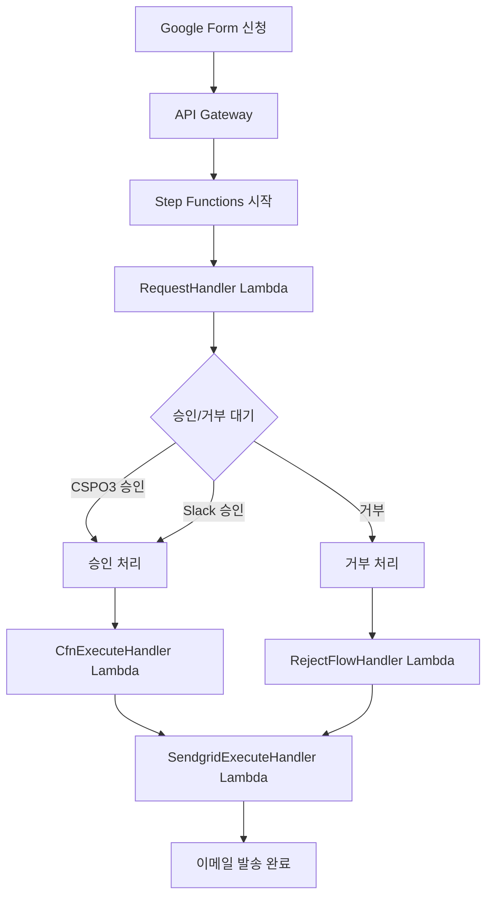

# CloudFormation-MasterClass

```mermaid
graph TD
    A[Google Form 신청] --> B[API Gateway]
    B --> C[Step Functions 시작]
    C --> D[RequestHandler Lambda]
    D --> E{승인/거부 대기}
    E -->|CSPO3 승인| F[승인 처리]
    E -->|Slack 승인| F
    E -->|거부| G[거부 처리]
    F --> H[CfnExecuteHandler Lambda]
    G --> I[RejectFlowHandler Lambda]
    H --> J[SendgridExecuteHandler Lambda]
    I --> J
    J --> K[이메일 발송 완료]
```
